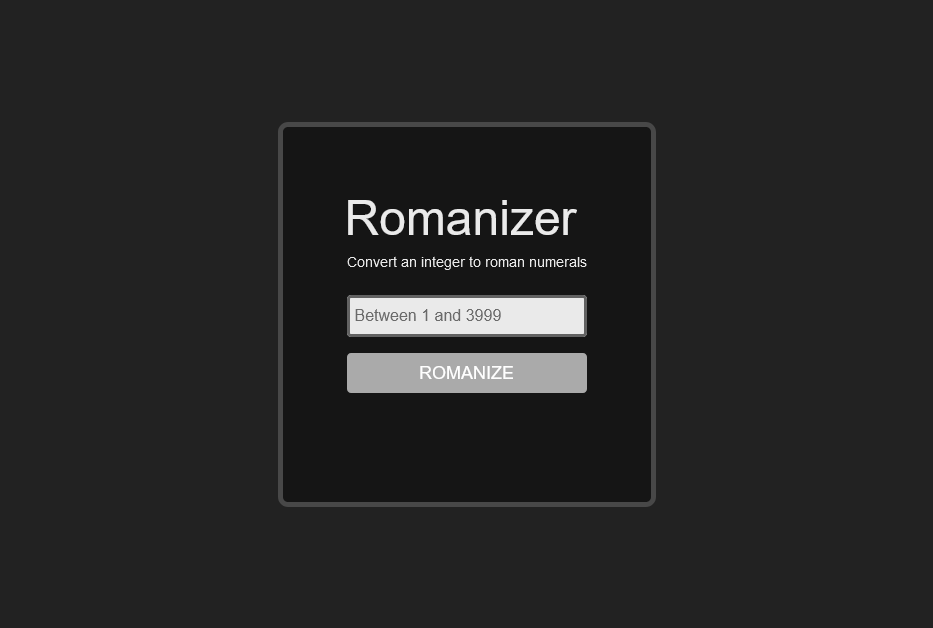

# Roman Numeral Converter

## Roman Numeral Specification(s)

The primary specification I used was [wikipedia](https://en.wikipedia.org/wiki/Roman_numerals).

To check my conversion results, I
found [RapidTables](https://www.rapidtables.com/convert/number/roman-numerals-converter.html) to be a
useful tool.

As per the provided project specification, the supported range of integers is 1-3999. Anything outside
of that range will be rejected.

## Prerequisites

Before you get started, make sure you have these dependencies installed:

- [Java](https://www.java.com/en/) (this project was written with openjdk-23.0.2 but others may work)
- [Maven](https://maven.apache.org/)
- [nodejs](https://nodejs.org/en) (LTS version recommended)
- [yarn](https://yarnpkg.com/getting-started/install) or npm (included with nodejs)

## Getting Started

### Step 1: Installation

Clone the repository

```shell
git clone git@github.com:cwwrussell/RomanNumerals.git
```

Install server dependencies:

```shell
mvn install
```

Install client dependencies:

```shell
yarn
```

or

```shell
npm install
```

### Step 2: Running the project

To run the java server:

```shell
mvn spring-boot:start
```

To run the react application:

```shell
yarn start
```

Once both the react application and the dev server are running,
navigate to localhost:3000 in your browser.



## Packaging Layout

### Project Structure

Primary file tree for the project:

```
.
├── ./assets
├── ./public
└── ./src
    ├── ./src/main
    ├── ./src/test
    ├── ./src/web
    └── ./src/index.tsx
```

- **assets**: screenshots for the README (files not included in production build)
- **public**: assets used by the web application (e.g. favicon.ico)
- **src**: project code
- **src/main**: primary java source directory; contains converter logic and REST endpoints
- **src/test**: java test directory
- **src/web**: primary web application directory; contains UI elements and web application logic
- **src/index.tsx**: entry point for the web application

Some factors influenced this structure in a minor way. The default `create-react-app` webpack configuration
explicitly requires the entry point (`src/index.tsx`) to be nested within the `src` directory. However, in
the interest of keeping the client and server logic separate, I chose to nest all other code for the web application
in the `src/web` subdirectory.

### Packaging Strategy (Web Application)

#### Primary Web Application Resources (components, services, utils, etc.)

One of the big hurdles I've faced in my day-to-day work on web applications is blurry or overlapping nomenclature.
To that end, when I write a new function/method, I favor the approach of forcing access through a single module level
export. Additionally, I tend to drift towards default exports as it is a nice way to indicate that something is the
primary export from a module.

Example:

```TypeScript
import User from '@models/interfaces/user';

const fetchUser = async (id: number) => {
  /* fetch user logic */
};

const updateUser = async (user: User) => {
  /* user update logic */
};

const UserService = {
  fetch: fetchUser,
  update: updateUser,
};

export default UserService;
```

There are some cases where I depart from this pattern (see named exports in the [store](./src/web/state/store.ts)), but
I try to adhere to it where possible. It's certainly more of a subjective preference, but it helps me maintain the
pieces
of a project for which I'm responsible.

#### Unit Tests

Web projects can grow so large that creating and continuously synchronizing a separate test directory can be tedious.
To that end, I usually keep the unit test modules in the same directory as their corresponding service module.

It's sometimes difficult to decide what to/not to test, but it was mainly a judgment call. Some logic is simple enough
that writing a unit test mainly serves as a formality and to reduce bandwidth. Certainly, it's good to have as much test
coverage as possible, but exhaustive testing can lead to never-ending development cycles.

When writing unit tests, I focus on covering the business logic - especially where there may be side effects and/or
state changes.

### Packaging Strategy (Java Server)

#### Primary Java Resources

I chose to use Java primarily because it's a technology I haven't used in a good while. So, my approach may be a bit
rudimentary, but it's familiar and straight-forward. The logic for the roman numeral conversion is separate from its
endpoint in its own service class. I did this to cut down the code bloat in the api/application class.

For the conversion logic, I chose to create a 'static-esque' service class, because it didn't seem necessary to write an
instantiable `RomanNumeral` class. The endpoint does a quick conversion and returns the value, but doesn't keep the data
alive or persist it in any way.

#### Unit Tests

Since I'm less familiar with Java, I used the default structure from when the project was created. This meant keeping
the
tests for each class in its own file mirroring the primary java directory.

### Dependency Attribution

#### Web Application Dependencies

To create the project, I used [create react app](https://create-react-app.dev/), which comes with a few default
dependencies (jest, react, etc.).

I chose not to add a component library and instead wrote my own form controls (text box, button). In my work, I've used
a few different component libraries, but I tend to favor writing my own components unless it departs from the project
patterns/standards.

Dependencies I added:

- **react-app-rewired**: used to override some of the options in the default webpack config (to avoid ejecting the react
  project)
- **sass**: used for app theming and component styling
- **@reduxjs/toolkit**: used for state management
- **react-redux**: used for state management
- **prettier**: used for auto formatting code in development

#### Java Server Dependencies

I used spring/spring boot when creating the Java project, which came with some default dependencies. But, in writing the
unit tests, I added junit-jupiter.

### Documentation Notes

I attempted to keep most of my code clear and simple enough to be 'self documenting', otherwise I've added comments to
(hopefully) clarify and explain the logic.